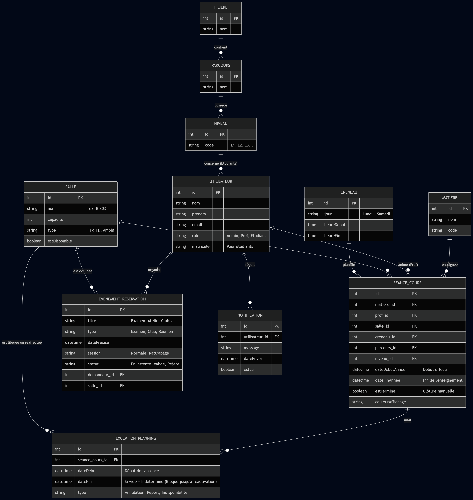
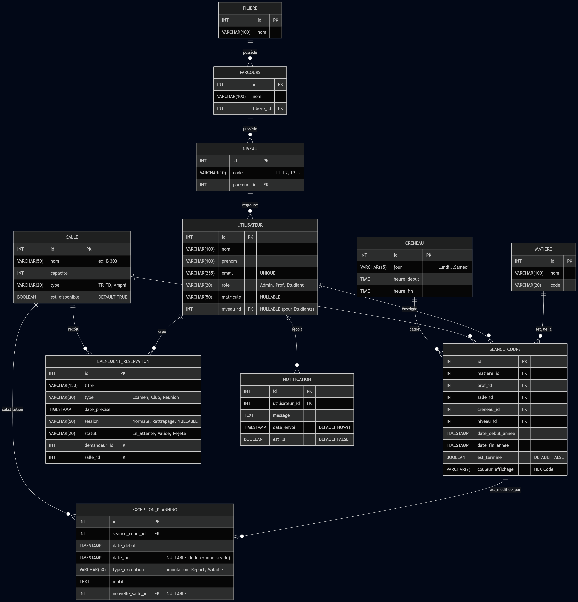
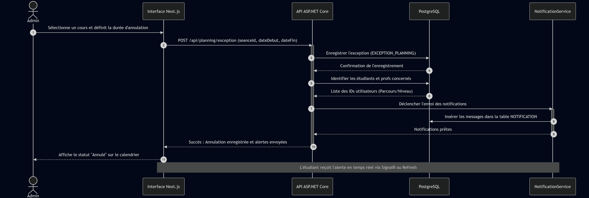

# 📅 App-EMIT - Système de Gestion des Salles et de l'Emploi du Temps

## 📌 Vue d'ensemble

**App-EMIT** est une application complète de gestion des salles de classe et de l'emploi du temps (EDT) pour les institutions éducatives. Elle permet aux administrateurs, professeurs, étudiants et responsables de formations de gérer efficacement les réservations de salles, les créneaux horaires et les emplois du temps.

---

## 🎯 Objectifs Principaux

- ✅ Gestion centralisée des salles et des équipements
- ✅ Planification automatisée de l'emploi du temps
- ✅ Système de réservation de salles par demande
- ✅ Notifications en temps réel
- ✅ Gestion des disponibilités et indisponibilités
- ✅ Traçabilité complète des modifications (logs)

---

## 👥 Acteurs du Système

### 1. **Administrateur**
- Gestion complète des professeurs
- Configuration des créneaux horaires
- Gestion des salles et matières
- Gestion des utilisateurs
- Consultation de l'historique
- Gestion complète de l'EDT

### 2. **Professeur**
- Consultation de son emploi du temps
- Demande d'indisponibilité
- Consultation de l'EDT pour son département
- Support des modifications manuelles

### 3. **Étudiant**
- Demande de réservation de salle
- Consultation des disponibilités
- Accès au portail de réservation
- Notifications de confirmation/refus

### 4. **Responsable Formation**
- Génération et validation des EDT
- Consultation des histogrammes d'utilisation
- Export des données (PDF/Excel)
- Gestion des conflits de planification

---

## 🏗️ Architecture et Conception

### Modèle Conceptuel de Données (MCD)



Le MCD définit les entités principales du système :
- **FORMATION** : Programmes de formation/enseignement
- **UTILISATEUR** : Professeurs, étudiants, administrateurs
- **SALLE** : Salles de classe avec équipements
- **SÉANCE** : Sessions d'enseignement
- **CRÉNEAU_HORAIRE** : Plages horaires disponibles
- **RÉSERVATION_SALLE** : Demandes de réservation
- **INDISPONIBILITÉ_SALLE** : Périodes d'indisponibilité
- **NOTIFICATION** : Alertes et confirmations
- **LOG_MODIFICATION** : Traçabilité des changements

### Modèle Logique de Données (MLD)



Le MLD présente la structure relationnelle complète avec :
- **FORMATION** : Code, mention, parcours, niveau, année universitaire
- **SALLE** : Identification, libellé, type, capacité, étage, équipements
- **MATIÈRE** : Code, libellé, volume horaire total et effectif
- **UTILISATEUR** : Matricule, nom, prénom, email, rôle
- **SÉANCE** : Identifiant, dates, professeur, matière, type (EDT/non-EDT)
- **CRÉNEAU_HORAIRE** : Jour, heures (début/fin), durée
- **RÉSERVATION_SALLE** : Demande avec validateur et statut
- **INDISPONIBILITÉ_SALLE** : Date début/fin et raison
- **NOTIFICATIONS** : Message, date, statut de lecture
- **LOG_MODIFICATION** : Historique complète des modifications

---

## 📊 Diagramme de Cas d'Utilisation


### Principaux Cas d'Usage

**Gestion des Salles & Équipements de Temps :**
- Créer/modifier/consulter les salles
- Ajouter une salle
- Modifier une salle
- Décliner indisponibilité

**Gestion des Utilisateurs :**
- Consulter professeurs
- Consulter utilisateurs
- Consulter historique
- Gérer formulations

**Réservation de Salles :**
- Consulter planning salles
- Demander une salle
- Ajouter/modifier une observation
- Valider/annuler la demande

**Gestion de l'Emploi du Temps :**
- Optimiser occupation
- Valider EDT
- Créer un EDT
- Générer/imprimer EDT
- Supprimer seance dans EDT
- Exporter EDT en Excel/PDF

---

## 🔄 Diagramme de Séquence - Demande de Réservation



### Processus Complet :

**Étape 1 : La demande est soumise**
1. Étudiant se connecte au portail
2. Authentification et vérification des credentials
3. Accès autorisé avec affichage du menu
4. Création de la demande de réservation
5. Vérification des produits et disponibilités
6. Insertion en base de données
7. Notification au responsable
8. Création de la notification

**Étape 2 : Validation/Refus par le Responsable**
- Consultation des demandes en attente
- Validation de la demande
- Mise à jour du statut
- Notification de l'étudiant

**Résultats possibles :**
- ✅ Réservation confirmée
- ❌ Réservation refusée
- 📧 Notifications envoyées par email

---

## 📐 Diagramme de Classes


### Relations Principales :

```
Formation
├── contient → Matière
└── planifie → Séance

Professeur
├── assure → Séance
└── enseigne → Matière

Salle
├── héberge → Séance
└── réserve → Réservation_Salle

Créneau_Horaire
├── fin → Séance
├── début → Séance
└── durée_minutes → INT

Utilisateur
├── demande → Réservation_Salle
└── valide → Réservation_Salle

Séance
├── planifiée → Créneau_Horaire
├── fin → Créneau_Horaire

Réservation_Salle
├── indisponible → Indisponibilité_Salle
└── réservée → Salle

EDT (Emploi Du Temps)
└── référencé par → Responsable_Formation
```

### Contraintes MLD :
```
Contrainte : id_créneau_fin ≠ id_créneau_début
(Une séance peut durer plusieurs créneaux)
```

---

## 🗄️ Entités Principales

### Formation
- **id_formation** (PK) : INT
- code_formation : VARCHAR(20) - Clé unique
- mention : VARCHAR(100)
- parcours : VARCHAR(100)
- niveau : VARCHAR(10)
- année_universitaire : VARCHAR(9)
- est_active : BOOLEAN

### Utilisateur
- **id_utilisateur** (PK) : INT
- matricule : VARCHAR(20) - Clé unique
- nom : VARCHAR(100)
- prénom : VARCHAR(100)
- email : VARCHAR(150)
- mot_de_passe_hash : VARCHAR(255)
- rôle : VARCHAR(20)

### Salle
- **id_salle** (PK) : INT
- code_salle : VARCHAR(20)
- libellé : VARCHAR(100)
- type_salle : VARCHAR(20)
- capacité : INT
- étage : INT
- équipements : TEXT
- est_active : BOOLEAN

### Séance
- **id_séance** (PK) : INT
- id_édt (FK) : INT
- id_salle (FK) : INT
- id_professeur (FK) : INT
- id_matière (FK) : INT
- id_jour_semaine (FK) : INT
- id_créneau_début (FK) : INT
- id_créneau_fin (FK) : INT
- date_séance : DATE
- type_séance : VARCHAR(20)
- statut : VARCHAR(20)
- remarque : TEXT

### Réservation_Salle
- **id_réservation** (PK) : INT
- id_demandeur (FK) : INT
- id_salle (FK) : INT
- id_validateur (FK) : INT
- date_demande : TIMESTAMP
- date_réservation : DATE
- motif : TEXT
- statut : VARCHAR(20)

### Indisponibilité_Salle
- **id_indisponibilité** (PK) : INT
- id_salle (FK) : INT
- date_début : TIMESTAMP
- date_fin : TIMESTAMP
- raison : TEXT

### Notifications
- **id_notification** (PK) : INT
- id_utilisateur (FK) : INT
- titre : VARCHAR(200)
- message : TEXT
- date_création : TIMESTAMP
- est_lue : BOOLEAN

### Log_Modification
- **id_log** (PK) : INT
- id_utilisateur (FK) : INT
- table_modifiée : VARCHAR(50)
- action : VARCHAR(50)
- ancienne_valeur : TEXT
- nouvelle_valeur : TEXT
- date_modification : TIMESTAMP

---

## 🛠️ Technologie Utilisée

- **Backend** : À définir (Java/Spring, Python/Django, Node.js, etc.)
- **Frontend** : À définir (Angular, React, Vue.js, etc.)
- **Base de Données** : SQL (MySQL, PostgreSQL, etc.)
- **Authentication** : JWT ou Sessions
- **API** : REST API

---

## 📦 Installation et Déploiement

À configurer selon la technologie choisie.

---

## 📝 Licence Commerciale

### Accord de Licence Propriétaire Exclusif

**App-EMIT** est une application logicielle propriétaire protégée par les droits d'auteur.

#### 📋 Termes et Conditions

**© 2026 Djenidi & Team. Tous droits réservés.**

Cette application est fournie sous une **Licence Commerciale Propriétaire Exclusive**. 

#### ✅ Droits Accordés

Sous le respect des conditions suivantes, le titulaire de la licence a le droit de :

1. **Utiliser l'application** - Pour les opérations commerciales autorisées dans les institutions éducatives
2. **Déployer l'application** - Sur les serveurs spécifiés dans l'accord de licence
3. **Support technique** - Accès au support technique prioritaire pendant la durée de la licence
4. **Mises à jour et patches** - Recevoir les mises à jour correctives et de sécurité
5. **Personnalisations limitées** - Adaptations techniques autorisées avec approbation écrite

#### ❌ Restrictions

Il est **strictement interdit** de :

- ✗ Copier, reproduire ou dupliquer le code source ou l'application
- ✗ Modifier, décompiler ou désassembler le logiciel
- ✗ Distribuer, vendre ou louer le logiciel sans autorisation écrite
- ✗ Créer des œuvres dérivées basées sur ce logiciel
- ✗ Utiliser l'application à titre personnel ou privé (usage commercial exclusif)
- ✗ Transférer la licence à un tiers sans consentement écrit
- ✗ Utiliser le logiciel pour développer des applications concurrentes
- ✗ Supprimer ou modifier les avis de droits d'auteur et de licence

#### 💰 Modèles de Licence Disponibles

**1. Licence Annuelle Établissement**
- Forfait par établissement éducatif
- Jusqu'à 500 utilisateurs simultanés
- Support technique 24/7
- Mises à jour illimitées
- **Prix : Sur devis**

**2. Licence par Utilisateur**
- Licence par utilisateur connecté
- Support technique pendant les heures ouvrables
- Mises à jour incluses
- **Prix : Sur devis**

**3. Licence Gouvernementale/Publique**
- Accord spécial pour institutions publiques
- Conditions tarifaires préférentielles
- Support technique prioritaire
- **Prix : Sur devis**

**4. Licence Multi-Sites**
- Pour plusieurs établissements
- Gestion centralisée
- Support technique dédié
- **Prix : Sur devis**

#### 🔐 Sécurité et Confidentialité

- Les données gérées par l'application restent la propriété du client
- Nous garantissons la protection des données conformément au RGPD
- Les logs d'accès sont conservés à titre de preuve
- Audits de sécurité mensuels inclus dans le support

#### ⏱️ Durée et Renouvellement

- **Durée minimale** : 1 an (renouvelable)
- **Date d'expiration** : À spécifier dans le contrat d'achat
- **Renouvellement** : Possible 60 jours avant expiration
- **Résiliation** : Seulement après période minimale d'engagement

#### 💔 Garanties et Responsabilités

**Garantie Limitée :**
- L'application fonctionne conformément à sa documentation
- Support technique pour 90 jours après la livraison
- Corrections des bugs critiques

**Limitation de Responsabilité :**
- Dommages indirects, accidentels ou consécutifs exclus
- Responsabilité limitée au montant annuel de la licence
- Le client accepte l'utilisation "telle quelle"

#### 🔄 Mise à Jour des Conditions

- Les conditions de cette licence peuvent être modifiées avec 30 jours de préavis
- Les modifications ne s'appliquent pas aux licences actuelles

#### 📮 Contact et Facturation

Pour acheter une licence ou obtenir plus d'informations :
- **Email** : contact@app-emit.com
- **Téléphone** : +33 (0) X XX XX XX XX
- **Site Web** : www.app-emit.com
- **Support Commercial** : sales@app-emit.com

#### ⚖️ Juridiction

Cette licence est régie par les lois **françaises**.
Tout litige sera résolu devant les tribunaux compétents de **France**.

---

## 👨‍💼 Auteur

Projet: **App-EMIT**
Développé par : **Djenidi, Brunel, Michael, Romuald et Samson**

---

## 📞 Support

Pour toute question ou problème, veuillez contacter l'équipe de développement.
